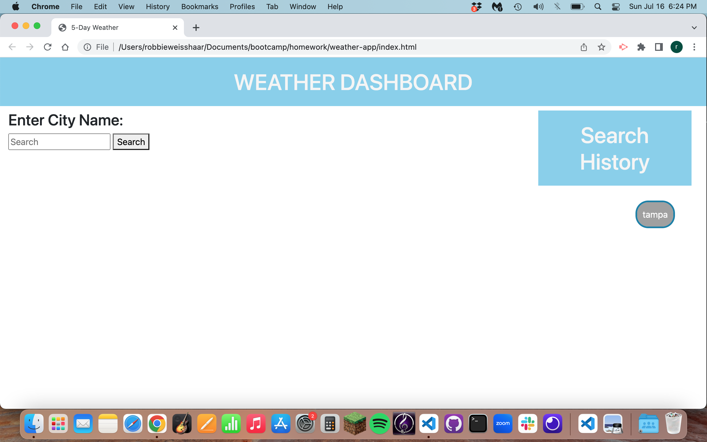

# Weather Dashboard

## Purpose:
- I wanted to make a website where I could check the weather for the next 5 days, and save my search results, so that I wouldn't have to retype the locations I look up.

## Instructions for Use:
- The website is very easy to use. The user types in a city they would like to check the weather for, and the weather for the next five days is displayed below, and a button is saved for the city they look up. They then should refresh the page, if they are to look up another city.

## Screen Shot:

## Link to Working Webpage:
 https://rweisshaar1.github.io/weather-app/
 
